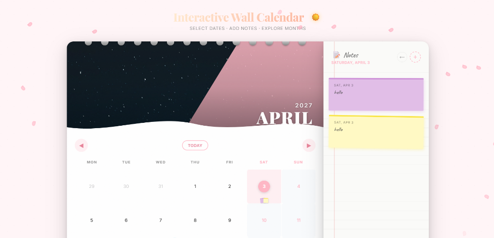
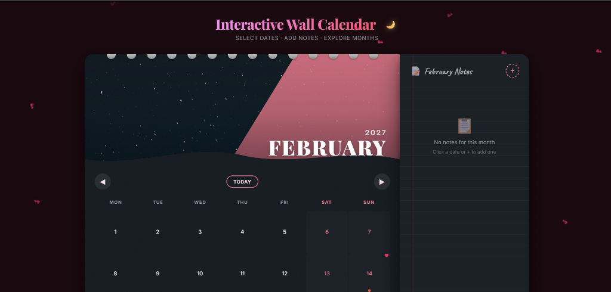
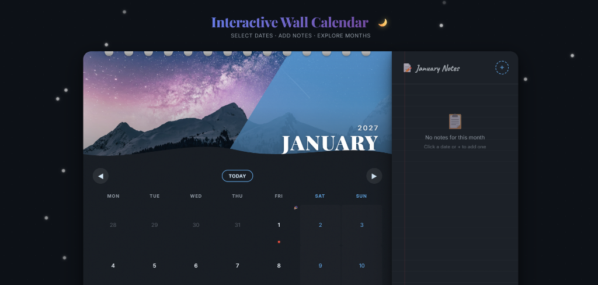

<div align="center">

# 📅 Interactive Wall Calendar

A beautifully crafted, skeuomorphic wall calendar built with **React + Vite**.  
Emulates the tactile feel of a real wall calendar — rich seasonal themes, realistic page-flip animations, sticky notes, and ambient particle effects.


</div>

---

## 🖼️ Screenshots

<div align="center">

### ☀️ Light Mode — April



<br />

### 🌙 Dark Mode — February



<br />

### 🌙 Dark Mode — January



</div>

---

## ✨ Features

### 🗓️ Core
- **Wall Calendar Aesthetic** — Spiral binding, paper texture, page curl effect, multi-layered drop shadows, and a diagonal accent shape
- **Day Range Selector** — Click to select start & end dates with visual states for range highlighting. Floating pill summary with day count
- **📝 Sticky Notes System** — Colorful post-it notes with handwriting font (Caveat), random slight rotations, inline editing, and `localStorage` persistence
- **Per-Month Notes** — Notes are scoped to each month — switching months shows only that month's notes
- **Fully Responsive** — Desktop side-by-side layout, tablet stacked drawer, mobile FAB toggle

### 🎨 Creative Extras
- **Seasonal Theme Engine** — 12 unique curated color palettes with high-quality Unsplash hero images (10 per month with auto-rotation)
- **🌙 Day/Night Mode** — Auto-detects system time. Toggle with a smooth circular clip-path wipe transition
- **📄 3D Page-Flip Animation** — Calendar page lifts from the spiral binding using CSS `perspective` + `rotateX` transforms
- **🌧️ Monsoon Rain Effect** — Dense rain particles with mist overlay and ground splashes for July & August
- **❄️ Ambient Particles** — Snow (Jan, Dec), Hearts (Feb), Sparkles (Mar), Petals (Apr), Fireflies (May), Bubbles (Jun), Rain (Jul, Aug), Leaves (Sep–Nov)
- **🎉 Holiday Markers** — Emoji badges with tooltips on notable dates (Republic Day, Diwali, Christmas, Valentine's Day, etc.)
- **🌊 Wave Divider** — SVG wave shape between hero image and calendar grid
- **✨ Micro-Interactions** — Hover scale-up on cells, pop animations, rotating "+" button, sticky note drop-in animation

---

## 🛠️ Tech Stack

| Technology | Purpose |
|:---|:---|
| **React 18** | Component architecture with hooks for clean state management |
| **Vite 6** | Lightning-fast HMR and optimized builds |
| **Vanilla CSS** | ~1900 lines of hand-crafted CSS — custom properties, keyframe animations, 3D transforms, `clip-path`, responsive media queries |
| **localStorage** | Client-side persistence for notes (zero backend) |
| **Google Fonts** | Inter (UI), Playfair Display (headings), Caveat (handwriting notes) |
| **Unsplash** | 120+ curated high-quality seasonal images |

---

## 🚀 Getting Started

### Prerequisites
- Node.js 18+
- npm 9+

### Installation

```bash
git clone <your-repo-url>
cd ProjectCalendar

npm install

npm run dev
```

The app will open at `http://localhost:5173`.

### Production Build

```bash
npm run build
npm run preview
```

---

## 📁 Project Structure

```
src/
├── App.jsx                              Main orchestrator — state, navigation, themes
├── index.css                            Complete design system (~1900 lines)
├── main.jsx                             React entry point
│
├── components/
│   ├── CalendarGrid/CalendarGrid.jsx    Week/day grid layout
│   ├── DayCell/DayCell.jsx              Individual day — range states, holidays, mini stickies
│   ├── HeroImage/HeroImage.jsx          Monthly hero photo with crossfade rotation
│   ├── MonthNavigator/MonthNavigator.jsx  Prev / Next / Today controls
│   ├── NotesPanel/NotesPanel.jsx        Notes sidebar with per-month filtering
│   ├── SpiralBinding/SpiralBinding.jsx  Decorative metallic spiral coils
│   ├── StickyNote/StickyNote.jsx        Individual sticky note with edit/delete
│   └── ThemeParticles/ThemeParticles.jsx  Seasonal ambient particles + rain overlays
│
├── data/
│   ├── holidays.js                      Static holiday data with emoji markers
│   └── themes.js                        12 monthly theme configurations
│
└── utils/
    ├── calendarUtils.js                 Date math, grid building, comparisons
    └── storageUtils.js                  localStorage CRUD, sticky note colors
```

---

## 🎯 How It Works

### Date Range Selection
1. **First click** → sets start date (accent circle)
2. **Second click** → sets end date, highlights range
3. **Third click** → resets and starts a new selection
4. Clicking the same date twice deselects it
5. A floating pill at the bottom shows the selected range summary

### Sticky Notes
- Click any **date cell** to select it → click again to pin a sticky note
- Use the **+** button to add notes via the form modal
- Attach notes to: this month, today, or a selected date
- Notes are **scoped per-month** and persist across sessions

### Month Navigation
- **◀ / ▶** triggers a realistic 3D page-lift animation
- **Today** button jumps to the current month instantly
- Each month loads its unique theme, hero images, and particle effects

### Day / Night Mode
- Auto-detects based on system time (6 AM – 6 PM = day)
- Toggle button triggers a smooth **circular clip-path wipe** transition
- Night mode features curated starry/moonlit hero images

---

## 📱 Responsive Breakpoints

| Breakpoint | Layout |
|:---|:---|
| ≥ 1025px | Side-by-side: calendar + notes panel |
| 641–1024px | Stacked calendar, notes as slide-up drawer |
| ≤ 640px | Compact mobile with FAB toggle for notes |
| ≤ 380px | Ultra-compact day cells |

---

## 📄 License

MIT

---

<div align="center">

Made with ❤️ by [Aniket](https://github.com/An17et)

</div>
